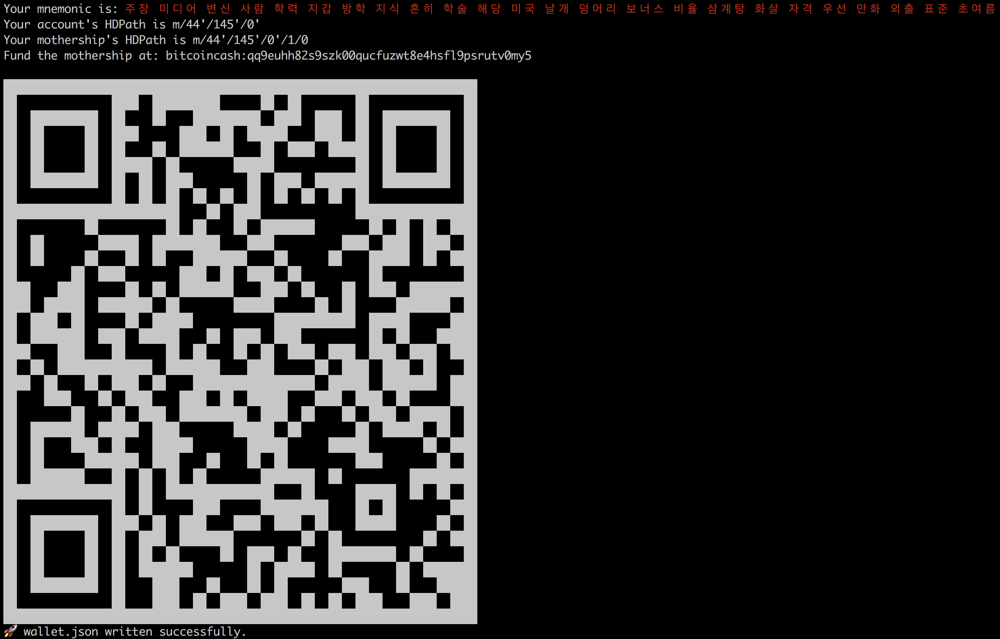

## Golden Ticket

Golden Ticket is [Bitcoin.com's](https://www.bitcoin.com) event paper wallet generator. Use it to create amazing golden tickets for your next event.

Not only does Golden Ticket let you chose a custom mnemonic language or hdpath but it also generates html, pdf and a spreadsheet mapping cashAddr, privKey, index and swept status of each golden ticket as well as generating stats.

## Features

- Generates mnemonic in 8 languages w/ custom HDPath

## Setup

Install [NodeJS](http://nodejs.org/) LTS version 8.x.

Clone the repo

`git clone https://github.com/Bitcoin-com/golden-ticket.git`

Install the dependencies

`cd golden-ticket && npm install`

## Generate Wallet

Create a 256 bit mnemonic and BIP44 BCH address

`npm run generate-wallet`

You'll be prompted for a language. You can enter any of the 8 listed below.

- english
- spanish
- french
- italian
- japanese
- korean
- chinese_simplified
- chinese_traditional

If you don't enter a language Golden Ticket will default to english.

Next you'll be promted for an HDpath. If you enter nothing Golden Ticket will default to the first BIP44 account of your mnemonic. ie: `m/44'/145'/0'`

Finally you'll be prompted for a wallet name. Don't include the file extension. If you enter nothing it will default to a `goldenTicketWallet.json` file and write to it your mnemonic, hdPath and mothership address.

Lastly Golden Ticket will show you a QR code of your mothership address. The HD path for the mother ship address is `hdpath/1/0`. The mothership address is the address which you intially fund which then funds all the generated addresses.

## Fund Mothership

You'll need to reload funds to the mothership more than once to fund all generated addresses. For this you can `npm run fund-mothership`.

This will show your mothership address and a QR code to easily fund.

## Create addresses

Run `npm run create-addresses`.

This will create `n` privkeyWIFs as a QR code saved to a PDF.

## Redeem Unswept Funds

Run `npm run redeem-unclaimed-funds` to have funds sent back to the funders cashAddr

## Generate Stats

Run `npm run generate-stats` to generate basic stats about your event.
