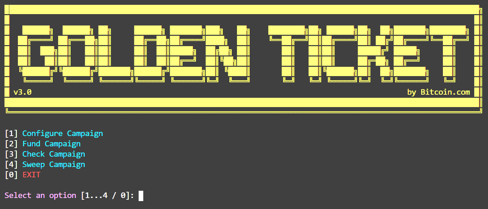

# 🎟️ Golden Ticket v3.0

Golden Ticket is [Bitcoin.com's](https://www.bitcoin.com) event paper wallet generator. Use it to create amazing golden tickets for your next event.

- [🎟️ Golden Ticket v3.0](#%f0%9f%8e%9f%ef%b8%8f-golden-ticket-v30)
  - [🏆 Features](#%f0%9f%8f%86-features)
  - [🚀 Getting started](#%f0%9f%9a%80-getting-started)
  - [🧙 Usage](#%f0%9f%a7%99-usage)
  - [⚙️ Settings](#%e2%9a%99%ef%b8%8f-settings)
  - [📜 Templates](#%f0%9f%93%9c-templates)
  - [🙌 Contributing](#%f0%9f%99%8c-contributing)
  - [🗃️ Packages](#%f0%9f%97%83%ef%b8%8f-packages)
  - [📝 License](#%f0%9f%93%9d-license)

## 🏆 Features

- Easy to use wizard based GUI
- Supports Bitcoin Cash and SLP Tokens [<sup>1</sup>](#1)
- Multi platform (runs on Windows, MacOS and Linux)
- Localization support for GUI and Mnemonic generation (en, ja, zh, zh-Hans, fr, it, ko, es) [<sup>2</sup>](#2)
- Template system for custom designs
- Fund ALL tickets with one transactions
- Create and manage multiple Golden Ticket campaigns
- Create custom ticket spreads (tiered fund distribution - see [Create Campaign](./docs/configure-campaign.md))
- Create HTML and PDF files for printing/distribution
- Create CSV and JSON reports on all tickets (data includes ticket address, wif, balance & claim status)
- Sweep unclaimed campaign funds

<sup id="1">1</sup> SLP Support is very limited and untested, please use BCH ONLY until further notice\
<sup id="2">2</sup> Mnemonic generates with selected locale but GUI is english only - translations needed

## 🚀 Getting started

1. Download [release](../../releases) and extract
2. Navigate to extracted directory and run (see [Usage](#usage) below)
   - Windows: double click `GoldenTicket.exe`
   - MacOS/Linux: run `./GoldenTicket-[macos|linux]`

## 🧙 Usage

Launching GoldenTicket, you will be presented with a menu of five options. To select an option, simply press the corresponding number on your keyboard. See below for more information on the different options.



If it's your first time running GoldenTicket, select option 1 - [Configure Campaign](./docs/configure-campaign.md)

1. [Configure Campaign](./docs/configure-campaign.md) - add and manage campaigns
2. [Fund Campaign](./docs/fund-campaign.md) - load and distribute funds to tickets
3. [Check Campaign](./docs/check-campaign.md) - scans tickets and generates claim reports
4. [Sweep Campaign](./docs/sweep-campaign.md) - sweeps unclaimed tickets into chosen wallet
5. EXIT - exits GoldenTicket app

## ⚙️ Settings

There are a few global settings for GoldenTicket, these can be configured in the `settings.json` file.

```json
{
  "debug": true /* print debug messages */,
  "locale": "en" /* locale for GUI & Mnemonic - en, ja, zh, zh-Hans, fr, it, ko, es */,
  "outDir": "output" /* directory where campaign data gets generated */,
  "templateDir": "templates" /* direcotry where templates load from */,
  "hdpath": "m/44'/145'" /* used when generating HDNodes  */,
  "timer": 50 /* time between operations in ms (use 0 to disable) */,
  "tickets": 10 /* default number of tickets when creating a campaign creation */
}
```

## 📜 Templates

Templates allow for custom ticket designs. Included in this package is a single `default` template (image below). To make new templates, see the documentation [Creating Templates](./docs/creating-templates.md).


## 🙌 Contributing

Feel free to open issues to propose stuff and participate. Pull requests are also welcome.

To setup your environment and start developing, check-out the [Developer Documentation](./docs/developer-documentation.md)

## 🗃️ Packages

- [ajv](https://github.com/epoberezkin/ajv) - Another JSON Schema Validator
- [bitbox-sdk](https://developer.bitcoin.com/bitbox/) - BITBOX SDK for Bitcoin Cash
- [chalk](https://github.com/chalk/chalk#readme) - Terminal string styling done right
- [fs-extra](https://github.com/jprichardson/node-fs-extra) - Extra Node.js fs methods
- [json-2-csv](https://github.com/mrodrig/json-2-csv#readme) - A JSON to CSV and CSV to JSON converter
- [log4js](https://log4js-node.github.io/log4js-node/) - Port of Log4js to work with node.
- [node-emoji](https://github.com/omnidan/node-emoji#readme) - Simple emoji support
- [pdfkit](http://pdfkit.org/) - A PDF generation library
- [pkg](https://github.com/zeit/pkg#readme) - Package your Node.js project into an executable
- [qrcode](http://github.com/soldair/node-qrcode) - QRCode / 2d Barcode api
- [qrcode-terminal](https://github.com/gtanner/qrcode-terminal) - QRCodes, in the terminal
- [readline-sync](https://github.com/anseki/readline-sync) - Synchronous Readline for interactively running
- [slp-sdk](https://github.com/Bitcoin-com/slp-sdk#readme) - SLP SDK powered by BITBOX
- [to-regex-range](https://github.com/micromatch/to-regex-range) - Pass two numbers, get a regex-compatible source string for matching ranges.

## 📝 License

Licensed under the [MIT License](/LICENSE).
