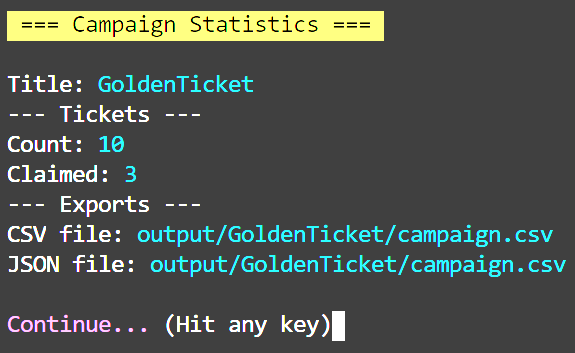

# Check Campaign

Checking the campaign scans all the tickets to see if they have been claimed.

A report is generated and saved to CSV and JSON - the report includes the tickets bch address, address wif, claimed status and value of funds.

