# Configure Campaign

This wizard will take you through the setup process of creating a new campaign or modifying an exsisting one. Follow the steps below.

Follow the steps to go through the process of creating a new campaign or modifying an exsisting one.

Campaign documents (pdf files, reports etc..) will automatically be generated at the end of the process.

When starting GoldenTicket for the first time, you will not have any campaigns saved. Create a new one by following the steps below.

## 1. Select a campaign

Select `+ ADD NEW` to start creating a new campaign.

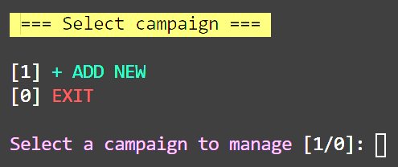

## 2. Select a template

Select `Default` to use the included template. To add more templates, see [Creating Templates](./creating-templates.md)

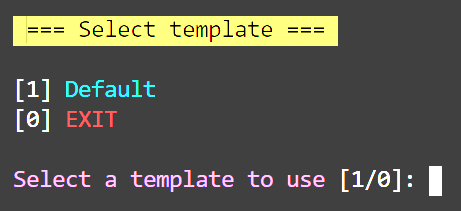

## 3. Choose a title

Type in a title for your campaign. Defaults to `GoldenTicket`.

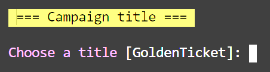

## 4. Generate a mnemonic

Press `y` to auto generate a new mnemonic or `n` supply your own. The next screen will show the mnemonic, hit any key to continue.

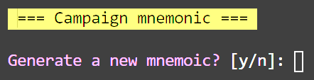

## 5. Campaign Tickets

Creating the ticket configuration is probably the most difficult part of this whole process. This is where number of tickets and the spread is created.

### 5.0 - Number of tickets

Type the total number of tickets for the campaign and hit `Enter`.

If enter is pressed without typing anything, number of tickets will default to `10` (configurable in [settings.json](../README.md#settings))

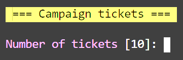

### 5.1 - Ticket spread

To fund tickets with different amounts a ticket spread is needed. The ticket spread is used during the funding process to distribute different amounts of bch/tokens to a range of tickets.

If no spread is needed (all tickets to be funded with equal value), type the total number of tickets chosen in the previous step [5.0 - Number of tickets](#50---number-of-tickets) and continue to next step.

There are two parts to a spread - a **_range_** of the tickets and the **_value_** multiplier for the range.

#### Example

A campaign is created with 10 tickets and a spread with three ranges (see table below).

| Range          | Value    |
| -------------- | -------- |
| Tickets: 1-5   | Value: 1 |
| Tickets: 6-9   | Value: 2 |
| Tickets: 10-10 | Value: 5 |

#### Spread creation

1. First choose a value for the spread (choose 1 for first range to save on math)

   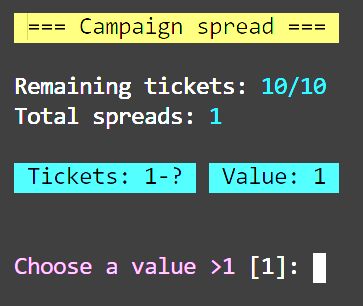

2. Select the range 'to' for above value.

   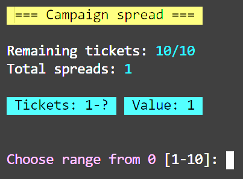

3. Repeat first two steps until all tickets are included in a range.

   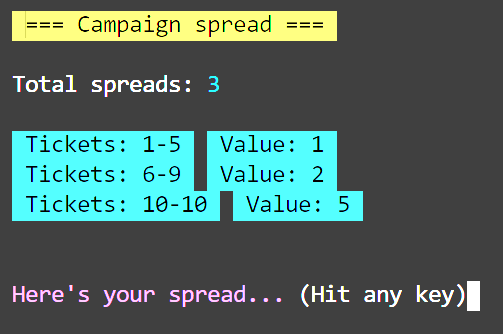

## 6. Confirm campaign

Before any files can be generted, the campaign must be saved. This step is shows a summary of the campaign and a simple y/n option to confirm. Choose `y` and wait for your files to generate.

### 6.0 Confirm campaign

Look over the summary of the campaign and if happy press `y`

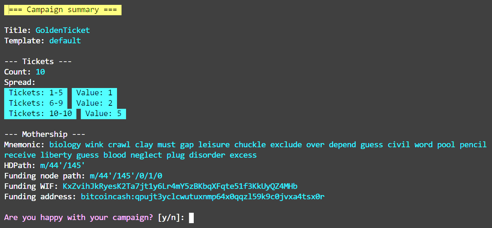

### 6.1 Generate files

Wait while files generate.

**NOTE: This can take some time depending on computer speed and number of tickets chosen in step [5.0 - Number of tickets](#50---number-of-tickets)**

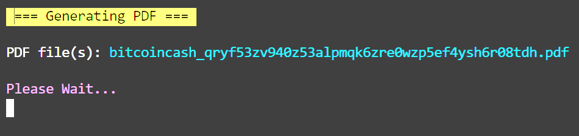

### 6.2 View summary

Finally a summary of the generated files. In your OS, Navigate to the campaign directory and inspect the generated files.

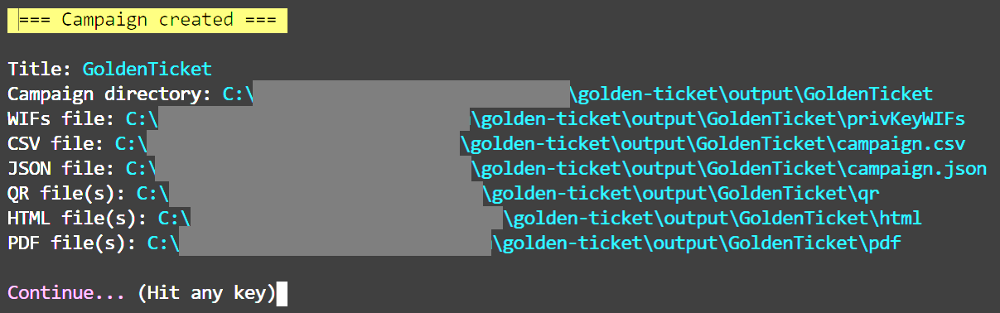
