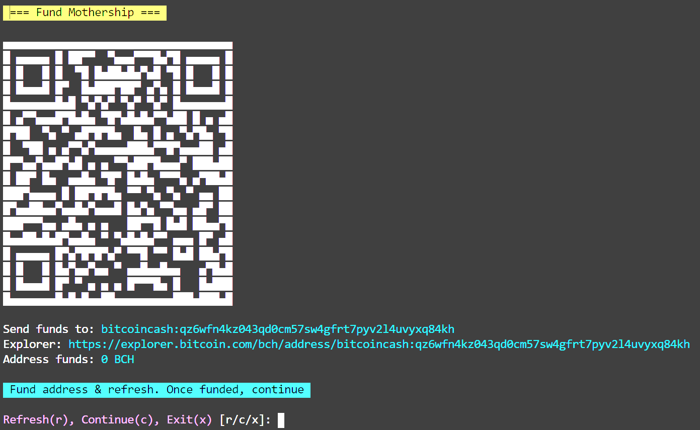

# Fund Campaign

Funding the sampaign is as easy as sending funds to a single address.

## 1. Select a campaign

Select the campaign you would like to fund

## 2. Choose funding type

Choose what you would like to fund tickets with. Bitcoin Cash (BCH) or SLP Token(t).

**_NOTE: CHOOSE BCH. SLP support is still a wip_**

## 3. Fund mothership

After selecting a funding type, a QR Code will be displayed. This QR is the mothership addres, the main wallet used to fund the tickets.

- Multiple transactions can be made to the mothership address
- ALL funds in the mothership wallet will be used when distributing funds to tickets
- Refresh the balance by pressing `r`
- Once funded, press `c` to continue. (this is disabled if address funds is 0)
- To return to main menu, press `x`

## 4. Fund Tickets

A breakdown of the funds distribution will be displayed. If you're happy with this, hit `y` to continue funding.

## 5. Funding summary

Funding happens pretty quickely (this is Bitcoin Cash after all). A transaction is built and broadcast containing all mothership utxos as inputs and all the tickets as outputs.

**_NOTE: it has not been tested for a LARGE amount of tickets, will need to test and possibly write a function to split ticket funding into multiple transactions..._**

